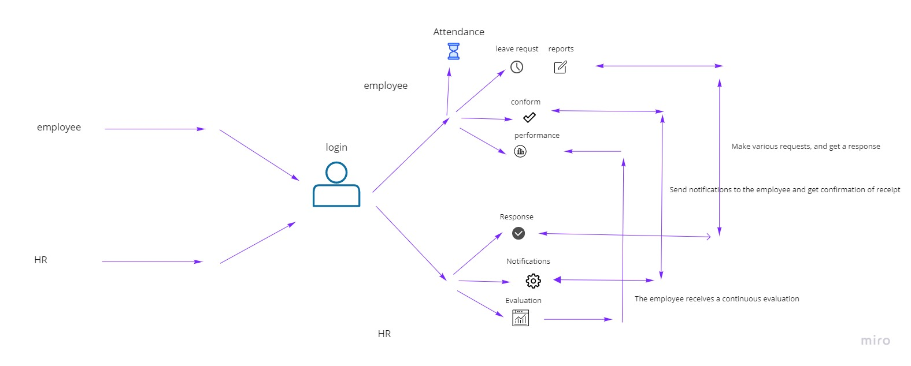

# Group Members

- Haya Balasmeh
- Sara Zwairi
- Omar Dyab
- Mohammad Noor Jebreen
- Mahmood Dinah
- Ali Rahhal

## Project Description

A human resource management system that helps employees starting their journey and deal with their HR processes to end with A paperless human resource system.

## Name of project

    HRBoost

## deployment  
- deploy link : https://hrb-oost-front-end.vercel.app/ 

- default account  :

     Ueser name : ali

     Password : 123456

## PM Tools

[PM](https://github.com/orgs/Next-Reme/projects/1)

## wireframes

## Domain Modeling

## Database Schema Diagram

