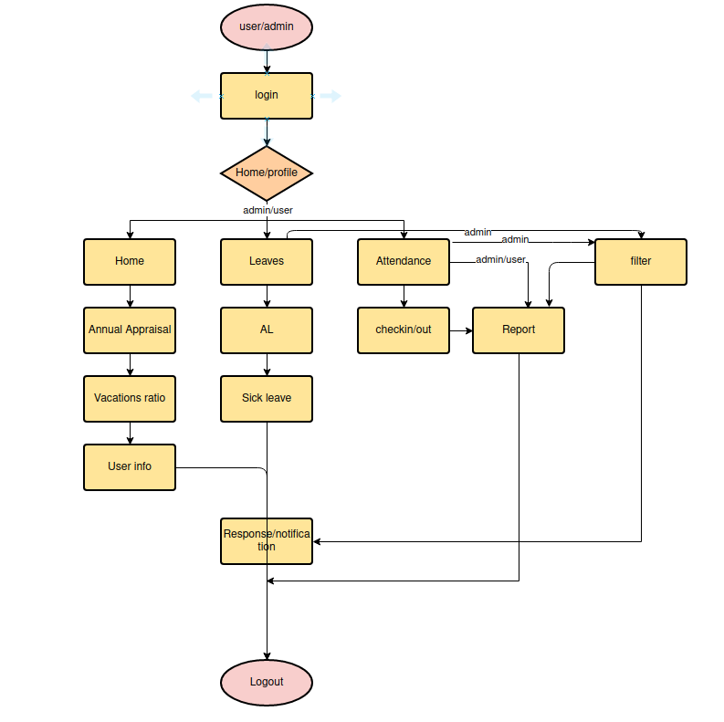

# Vision

## What is the vision of this product?

- Making the human resource management and operations easier and more efficient and paperless work.

## What pain point does this project solve?

- The huge amount of responsibilities for companies with large number of employees.

- Improper tracking of the employee status and data.

## Why should we care about your product?

- Our product will boost your employees productivity and their effeciency.

- Reduction of error generated by manual managment and entry.

- Our Product will give you the ability to track your data easily and Keeping your company’s information organized.

# Scope (In/Out)

## What our product will provide you with?

- Our application will provide the employee user with the ability to check his attendance.

- Our application will provide the employee user with the ability to make vacation and annual leaves request.

- Our application will provide the employee user with the ability to track his performance status.

- Our application will provide the HR user with the ability to view and modify employees users reports and requests.

## What our product won't provide you with?

- Our product won't be able to provide you with the ability to manage employee salaries, contributions made to a retirement program, or bonus information or healthcare deductions.

# Minimum Viable Product vs

- User login feature.

- Non-administrative User Reports Feature.

- Non-administrative User Attendance Feature.

- Non-administrative User Leaves and Vacation request Feature.

# Stretch Goals

- Job application by non employee user .

- Job Search by non employee user .

# Functional requirements:

## Data Flow

# Non- Functional requirements:

- **Usability** Our product will be easy to use and understand by the employees, by doing a short period of trial to ensure that.

- **Testability** testing our product for all of the benefits listed above, this will depend on your company situation, but at the very least, it should improve productivity, cut down on errors and make your data easier to keep track of.
